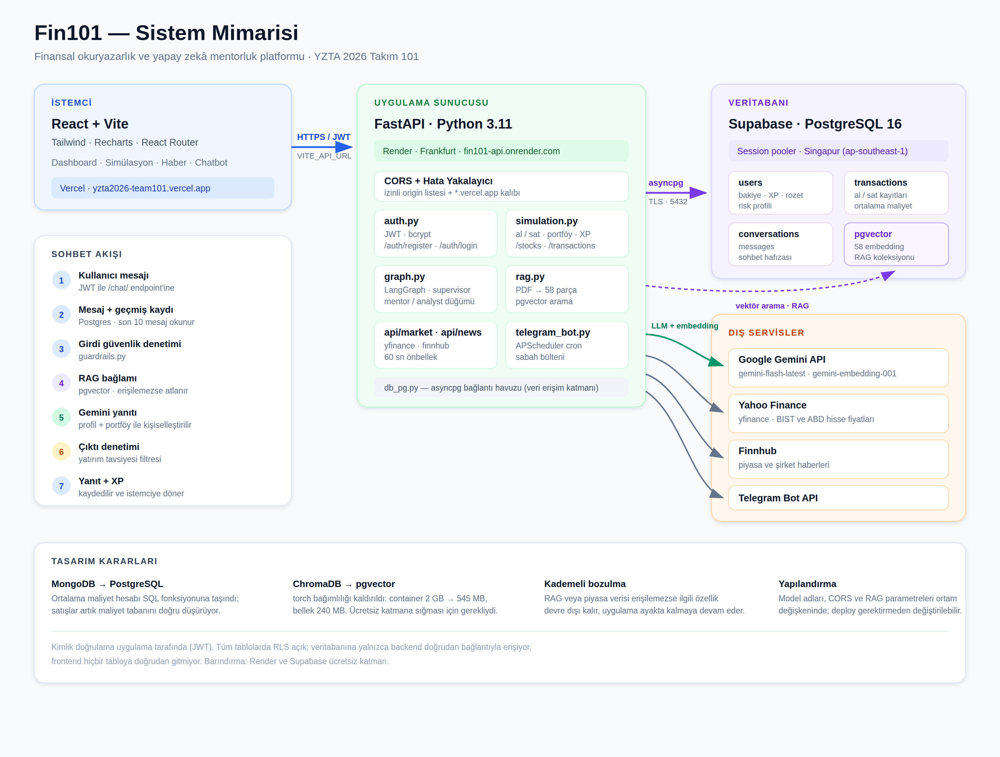
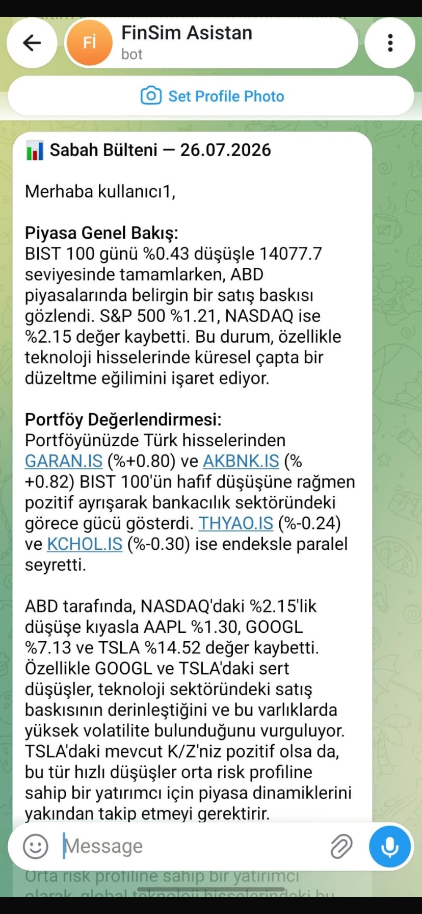
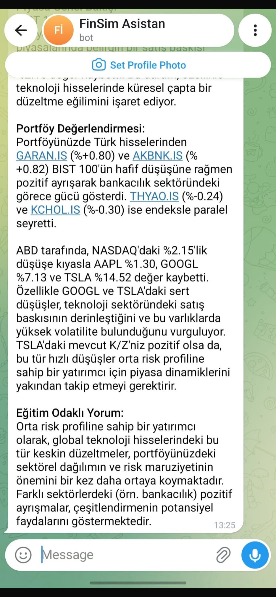
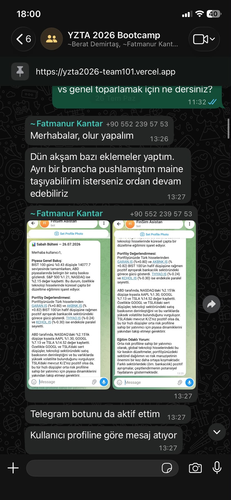
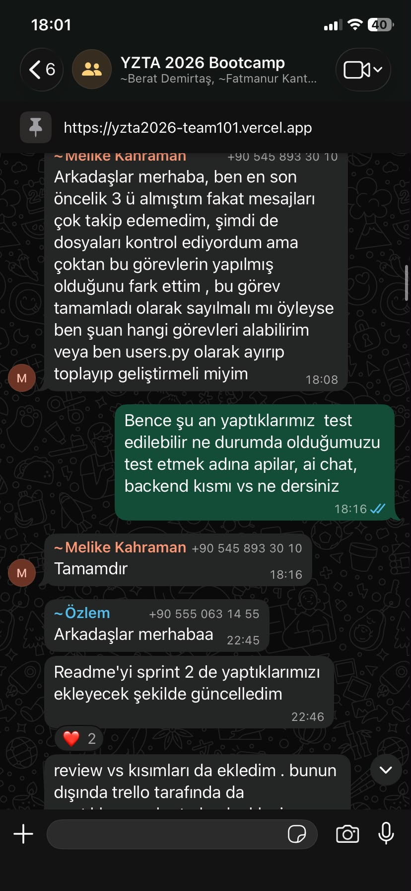
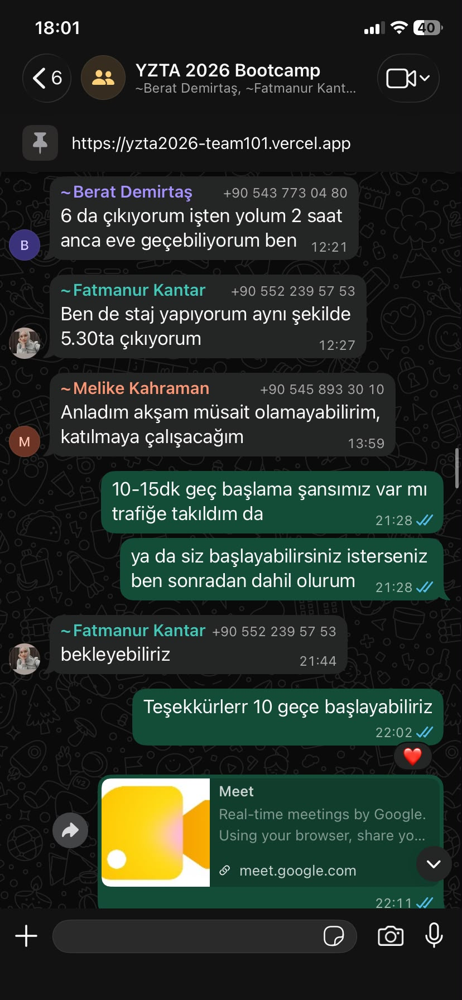

# Team101 — Fin101

## Takım Üyeleri
* **Fatımanur Kantar** – Product Owner
* **Özlem Kılıç** – Scrum Master
* **Berat Muhammet Demirtaş** – Developer
* **Melike Kahraman** – Developer
* **İbrahim Emin İpek** – Developer

## Ürün Açıklaması
Bu proje, özellikle genç kullanıcılara yönelik geliştirilen yapay zekâ destekli bir finansal okuryazarlık ve yatırım bilgilendirme platformudur.
Platform, kullanıcıların finansal farkındalıklarını artırmayı ve borsa hakkında bilinçli kararlar alabilmelerini desteklemeyi amaçlamaktadır.

Kullanıcılar sanal bakiye ile borsa simülasyonu yaparak gerçek para riski olmadan alım-satım deneyimi kazanabilir. Ayrıca yapay zekâ destekli chatbot ve güncel finansal haberler sayesinde piyasa gelişmeleri takip edilebilir ve finansal konularda bilgi edinilebilir.

Ürün, yatırım tavsiyesi sunmak yerine bilgilendirici ve yönlendirici bir yaklaşım benimseyerek finansal okuryazarlığın gelişmesine katkı sağlamayı hedeflemektedir.

---

## 🌐 Canlı Demo

| Katman | Adres |
|---|---|
| **Uygulama** | https://yzta2026-team101.vercel.app |
| **API** | https://fin101-api.onrender.com |
| **API Dokümantasyonu** | https://fin101-api.onrender.com/docs |

> Backend ücretsiz planda barındırıldığı için hareketsizlik sonrası ilk istek 30–50 saniye sürebilir; servis uyandıktan sonra normal hızına döner.

---

## Ürün Özellikleri

### 💰 Sanal Borsa Simülasyonu
* Sanal bakiye ile alım-satım işlemleri yapılabilir
* Gerçek para riski olmadan yatırım deneyimi kazanılır

### 🤖 Yapay Zekâ Destekli Chatbot
* Finansal konularda kullanıcı sorularını yanıtlar
* Bilgilendirici ve yönlendirici destek sağlar (RAG destekli Sokratik Mentor)

### 📰 Piyasa ve Haber Takibi
* Güncel borsa haberleri görüntülenir
* API aracılığıyla finansal gelişmeler takip edilir

### 📊 Dashboard
* Kullanıcı bakiye ve işlem geçmişi görüntülenir
* Tüm modüllere tek ekrandan erişim sağlanır

### 👤 Kullanıcı Profili
* Kullanıcı bilgileri ve hesap ayarları yönetilir

## Planlanan Sayfalar
* Dashboard
* Borsa Simülasyonu
* Haberler
* Chatbot
* Profil

## Arayüz Tasarımları

### Dashboard


### Borsa Simülasyonu


### Haberler


### Chatbot


### Profil


## Hedef Kitle
* 18–35 yaş arası gençler ve genç profesyoneller
* Finansal okuryazarlığını geliştirmek isteyen bireyler
* Borsaya ve yatırım dünyasına yeni adım atan kullanıcılar
* Gerçek para riski olmadan yatırım deneyimi kazanmak isteyen kişiler
* Güncel piyasa gelişmelerini takip ederek bilinçli finansal kararlar almak isteyen kullanıcılar

---

## Kullanılan Teknolojiler ve Mimari

Projemiz, temiz kod prensipleri ve modern yapay zekâ orkestrasyonu gözetilerek geliştirilmiştir.



Sistem dört katmandan oluşur: kullanıcının tarayıcısında çalışan **React arayüzü**, iş mantığını yürüten **FastAPI sunucusu**, verinin tutulduğu **Supabase/PostgreSQL** ve fiyat, haber ile yapay zekâ hizmetlerini sağlayan **dış servisler**. Frontend hiçbir zaman veritabanına doğrudan gitmez; tüm erişim backend üzerinden ve JWT ile kimliği doğrulanmış olarak yapılır.

| Katman | Teknoloji |
|---|---|
| **Proje Yönetimi ve Tasarım** | GitHub, Trello, Figma |
| **Frontend** | React 19, Vite, Tailwind CSS, Recharts, React Router |
| **Backend** | FastAPI, Uvicorn (asenkron mimari, Dependency Injection) |
| **Yapay Zekâ ve LLM** | Google Gemini (`gemini-flash-latest`), LangGraph |
| **RAG Orkestrasyonu** | LangChain, `gemini-embedding-001`, pgvector |
| **Kalıcı Veritabanı** | Supabase — PostgreSQL 16 (asyncpg) |
| **Kimlik Doğrulama** | JWT (python-jose), bcrypt |
| **Veri İşleme** | PyMuPDF, Pydantic v2 |
| **Finansal Veri** | yfinance (fiyat), Finnhub (haber) |
| **Bildirim** | Telegram Bot API, APScheduler |
| **Barındırma** | Render (API), Vercel (arayüz), Supabase (veritabanı) |

> **Not:** Sprint 1 ve 2'de MongoDB Atlas ve ChromaDB kullanılmıştı. Sprint 3'te veri katmanı PostgreSQL'e, vektör deposu pgvector'e taşındı. Gerekçeler Sprint 3 bölümünde ayrıntılı anlatılmıştır.

---

## Kurulum ve Çalıştırma

### Gereksinimler
Python 3.11+, Node.js 18+, bir PostgreSQL veritabanı (Supabase önerilir)

### Backend

```bash
cd backend
python -m venv venv && source venv/bin/activate   # Windows: venv\Scripts\activate
pip install -r requirements.txt
uvicorn main:app --reload
```

`backend/.env` dosyası:

```
DATABASE_URL=postgresql://postgres.<ref>:<parola>@<host>.pooler.supabase.com:5432/postgres
GEMINI_API_KEY=...
FINNHUB_API_KEY=...
TELEGRAM_BOT_TOKEN=...
JWT_SECRET_KEY=<uzun rastgele bir değer>
ALLOWED_ORIGINS=http://localhost:5173
```

> Veritabanı şeması için `supabase/migrations/` altındaki SQL dosyasını Supabase SQL Editor'de çalıştırın.

### Frontend

```bash
cd frontend
npm install
npm run dev
```

`frontend/.env.local` dosyası:

```
VITE_API_URL=http://localhost:8000
```

### İsteğe bağlı ortam değişkenleri

| Değişken | Varsayılan | Açıklama |
|---|---|---|
| `GEMINI_MODEL` | `gemini-flash-latest` | Sohbet modeli |
| `GEMINI_EMBEDDING_MODEL` | `models/gemini-embedding-001` | Embedding modeli |
| `RAG_CHUNK_SIZE` | `4000` | RAG parça boyutu |
| `ALLOWED_ORIGIN_REGEX` | `https://[a-z0-9-]+\.vercel\.app` | CORS kalıbı |

---

## Proje Yönetimi ve Sprint Kanıtları

* **Product Backlog URL:** [Team101 Trello Board](https://trello.com/invite/b/6a3d8286def1d4972225c9b8/ATTI1dc614b3193520b51446148521c146a8DF7982DE/sprintplan)

<details>
<summary><strong>Sprint 1</strong></summary>

### Sprint 1 Çıktıları
* **Backlog Düzeni ve Story Seçimleri:** İlk sprint için ekip kapasitesine uygun puanlamalar yapılmış, Story'ler mantıksal Task'lere bölünmüştür.
* **Daily Scrum Notları:** Takım içi iletişim günlük olarak yürütülmektedir. (Toplantı notları repodaki ilgili klasöre eklenecektir)[cite: 2].
* **Sprint Board Durumu:** 

* **Ürün Durumu:**  Sprint 1 itibarıyla yapay zeka tarafında RAG (Retrieval-Augmented Generation) mimarisinin temelleri atılmış; LangChain ve Gemini entegrasyonu ile finansal dokümanları okuyup Sokratik cevaplar üreten API endpoint'leri çalışır hale getirilmiştir. Veritabanı tarafında MongoDB bağlantısı altyapısı kurulmuş olup, veri tablolarının (koleksiyonların) oluşturulması ve sohbet hafızasının eklenmesi sonraki sprintlere planlanmıştır[cite: 2].
* **Detaylı Teknik Dokümantasyon:** Projenin mimari detayları ve geliştirme günlüğü için ana dizindeki `Fin101_Technical_Doc.md` dosyası incelenebilir.

### Daily Scrum Ekran Görüntüleri

<p align="center">
  
  
  
</p>

<p align="center">
  
  
  
</p>


### Sprint Review 

Sprint 1 kapsamında projenin temel backend mimarisi başarıyla oluşturulmuştur. FastAPI tabanlı REST API altyapısı geliştirilmiş, MongoDB Atlas ile asenkron veritabanı bağlantısı kurulmuş ve Pydantic v2 ile veri doğrulama yapısı hazırlanmıştır. Yapay zekâ tarafında Google Gemini 2.5 Flash, LangChain ve ChromaDB kullanılarak RAG (Retrieval-Augmented Generation) mimarisi hayata geçirilmiş; PDF dokümanlarını analiz ederek kullanıcıya yatırım tavsiyesi vermek yerine Sokratik yaklaşımla bilgilendirici yanıtlar üretebilen chatbot altyapısı tamamlanmıştır.

Sistem performansını ve sürdürülebilirliğini artırmak amacıyla LLM cache mekanizması, FastAPI Dependency Injection yapısı, CORS middleware entegrasyonu ve güvenli `.gitignore` yapılandırması uygulanmıştır. ChromaDB için kalıcı depolama altyapısı oluşturulmuş, PyMuPDF ile PDF okuma sistemi geliştirilmiş ve modüler proje mimarisi hazırlanmıştır.

Proje yönetimi tarafında GitHub deposu oluşturulmuş, teknik dokümantasyon hazırlanmış, Trello sprint panosu güncellenmiş ve uygulamanın arayüz tasarımları tamamlanmıştır. Sprint sonunda backend MVP (Minimum Viable Product) tamamlanmış ve proje frontend entegrasyonuna hazır duruma getirilmiştir. Sohbet geçmişi yönetimi, kimlik doğrulama, frontend geliştirmeleri ve finansal veri API entegrasyonları ise sonraki sprintlere aktarılmıştır.

### Sprint Retrospective 

#### İyi Yapılanlar

* Backend MVP planlanan kapsamda başarıyla tamamlandı.
* RAG mimarisi, Google Gemini, LangChain ve ChromaDB entegrasyonları çalışır hâle getirildi.
* FastAPI tabanlı modüler ve ölçeklenebilir proje mimarisi oluşturuldu.
* MongoDB Atlas bağlantısı, CORS yapılandırması ve güvenlik önlemleri başarıyla uygulandı.
* Teknik dokümantasyon, GitHub deposu ve Trello süreç yönetimi düzenli şekilde sürdürüldü.
* Uygulamanın temel arayüz tasarımları hazırlanarak frontend geliştirme süreci için hazır hâle getirildi.

#### Geliştirilebilecek Noktalar

* React/Vite tabanlı frontend geliştirilerek backend ile tam entegrasyon sağlanacaktır.
* Kullanıcı kimlik doğrulama (JWT) ve yetkilendirme sistemi eklenecektir.
* Sohbet geçmişi (chat memory) MongoDB üzerinde yönetilecek ve kullanıcı deneyimi geliştirilecektir.
* Finansal veri API'leri sisteme entegre edilerek gerçek zamanlı piyasa verileri sunulacaktır.
* Test süreçleri, global hata yönetimi, rate limiting ve Docker desteği eklenerek sistem üretim ortamına daha hazır hâle getirilecektir.

</details>

<details>
<summary><strong>Sprint 2</strong></summary>

### Sprint 2 Çıktıları
* **Backlog Düzeni ve Story Seçimleri:** Sprint 2 kapsamında frontend geliştirmeleri, sohbet hafızası, finansal veri API entegrasyonları ve backend–frontend bağlantısı önceliklendirilmiştir. User Story'ler ekip üyelerine dağıtılmış ve görevler teknik Task'lere ayrılmıştır.
* **Sprint Board Durumu:**
<p align="center">
  
  
</p>

* **Daily Scrum Notları:** Takım içi iletişim düzenli olarak sürdürülmüş, yapılan çalışmalar ve karşılaşılan problemler günlük takip edilmiştir. Toplantı notları ve ekran görüntüleri repodaki ilgili klasöre eklenmiştir.
* **Ürün Durumu:** Sprint 2 itibarıyla uygulamanın temel frontend arayüzleri geliştirilmiş ve backend servisleriyle bağlantıları kurulmuştur. Chatbot, Dashboard, Haberler ve Profil sayfalarının temel yapıları hazırlanmıştır. Chatbot tarafında kullanıcıların konuşmalarının oturum bazlı olarak saklanabilmesi için MongoDB üzerinde sohbet hafızası sistemi geliştirilmiştir.
Finansal veri entegrasyonu kapsamında anlık hisse fiyatlarının, tarihsel piyasa verilerinin, genel piyasa haberlerinin ve şirket bazlı haberlerin alınabilmesi için gerekli API endpoint'leri oluşturulmuştur. Backend ile frontend arasındaki iletişimi yönetmek amacıyla merkezi bir servis katmanı hazırlanmıştır.

### Daily Scrum Ekran Görüntüleri

<p align="center">
  
  
  
  

</p>

### Sprint 2 Review

Sprint 2 kapsamında uygulamanın backend altyapısı geliştirilmiş ve temel frontend sayfaları oluşturularak backend servisleriyle entegre edilmiştir. React ve Vite kullanılarak Dashboard, Haberler, Chatbot ve Profil sayfalarının temel arayüzleri hazırlanmıştır.

Chatbot modülünde kullanıcıların konuşmalarını oturum bazlı sürdürebilmesi amacıyla session_id yönetimi geliştirilmiştir. Konuşmalar ve mesajlar MongoDB üzerindeki conversations ve messages koleksiyonlarında saklanarak sohbet hafızası sisteme eklenmiştir. RAG tabanlı chatbot altyapısı bu hafıza sistemiyle birleştirilmiş ve kullanıcıların önceki mesajları dikkate alınarak yanıt üretilebilmesi sağlanmıştır.

Kullanıcı ve asistan mesajlarının güvenliğini kontrol etmek amacıyla giriş ve çıkış guardrail mekanizmaları uygulanmıştır. Chatbot cevaplarının frontend üzerinde daha okunabilir gösterilebilmesi için Markdown desteği ve yazı yazma animasyonu eklenmiştir.

Finansal veri tarafında yfinance kullanılarak anlık hisse fiyatı ve tarihsel OHLCV verilerini döndüren endpoint'ler geliştirilmiştir. Finnhub API entegrasyonu ile genel piyasa haberleri ve şirket bazlı haberler sisteme dahil edilmiştir. Frontend tarafında oluşturulan merkezi api.js servis katmanı üzerinden chatbot, piyasa fiyatları, tarihsel veriler ve haber servislerine erişim sağlanmıştır.

Dashboard sayfasında anlık hisse fiyatlarını gösteren kartlar oluşturulmuş, Haberler sayfası gerçek API verileriyle çalışacak şekilde geliştirilmiş ve haberler için kategori filtreleme özelliği eklenmiştir. Profil sayfasının temel arayüzü hazırlanmış ancak kullanıcı kimlik doğrulama sistemi henüz tamamlanmadığı için profil verileri geçici olarak statik tutulmuştur.

Sprint sonunda temel frontend–backend entegrasyonu, sohbet hafızası ve finansal veri servisleri tamamlanmıştır. Kullanıcı kimlik doğrulama sistemi, dinamik profil yönetimi ve sanal borsa simülasyonu ise Sprint 3 kapsamına aktarılmıştır.

### Sprint 2 Retrospective

#### İyi Yapılanlar

* Temel frontend mimarisi başarıyla oluşturuldu.
* Frontend ve backend arasındaki iletişim için merkezi API servis katmanı hazırlandı.
* Chatbot için session_id tabanlı sohbet yönetimi uygulandı.
* Konuşmalar ve mesajlar MongoDB üzerinde saklanarak sohbet hafızası tamamlandı.
* RAG sistemi sohbet hafızasıyla entegre edildi.
* Kullanıcı girdileri ve asistan çıktıları için guardrail kontrolleri eklendi.
* Yfinance ile anlık ve tarihsel piyasa verileri sisteme entegre edildi.
* Finnhub ile piyasa ve şirket haberleri uygulamaya dahil edildi.
* Dashboard ve Haberler sayfaları gerçek API verileriyle çalışır hâle getirildi.

#### Geliştirilebilecek Noktalar

* Sabit olarak kullanılan demo kullanıcı bilgileri gerçek kullanıcı hesaplarıyla değiştirilecektir.
* Profil sayfası MongoDB üzerindeki gerçek kullanıcı verileriyle eşleştirilecektir.
* Kullanıcıların profil bilgilerini düzenleyebileceği form yapısı eklenecektir.
* Borsa simülasyonu sayfası gerçek piyasa verileri ve sanal bakiye sistemiyle aktif hâle getirilecektir.
* Sanal hisse alım-satım işlemleri ve kullanıcı portföyü için gerekli backend endpoint'leri geliştirilecektir.
* Dashboard sayfasına kullanıcı portföy özeti ve kâr/zarar bilgileri eklenecektir.
* Test coverage, global hata yönetimi, rate limiting ve deployment çalışmaları tamamlanacaktır.

</details>

<details>
<summary><strong>Sprint 3</strong></summary>

### Sprint 3 Çıktıları

* **Backlog Düzeni ve Story Seçimleri:** Sprint 3, projenin **son ve tamamlayıcı** sprinti olarak planlanmıştır. Sprint 2'nin retrospektifinde belirlenen eksikler — kimlik doğrulama, dinamik profil, borsa simülasyonu, oyunlaştırma ve deployment — doğrudan bu sprintin User Story'lerine dönüştürülmüştür. Sprint ortasında, ücretsiz barındırma kısıtları nedeniyle **veri katmanı ve RAG altyapısının değiştirilmesi** kapsama eklenmiştir.
* **Sprint Board Durumu:** Sprint 3 panosu, [Trello board](https://trello.com/invite/b/6a3d8286def1d4972225c9b8/ATTI1dc614b3193520b51446148521c146a8DF7982DE/sprintplan) üzerinden takip edilmiştir.

<!-- Trello pano ekran görüntülerini images/ klasörüne sprint3_t1.png ve sprint3_t2.png adlarıyla
     ekledikten sonra aşağıdaki satırların yorum işaretlerini kaldırın.
<p align="center">
  
  
</p>
-->

* **Daily Scrum Notları:** Takım içi iletişim WhatsApp üzerinden günlük olarak sürdürülmüş; geliştirme sürecindeki teknik engeller ve çözümleri anlık paylaşılmıştır.
* **Ürün Durumu:** Sprint 3 sonunda uygulama **uçtan uca çalışır ve yayında** durumdadır. Kullanıcılar gerçek hesap açabilmekte, giriş yapabilmekte, sanal bakiyeleriyle hisse alıp satabilmekte, portföylerini ve kâr/zarar durumlarını görebilmekte, yapay zekâ mentoruyla sohbet edebilmekte ve Telegram üzerinden kişiselleştirilmiş sabah bülteni alabilmektedir.

### Telegram Sabah Bülteni — Çalışan Özellik Kanıtı

Sprint 3'ün en ayırt edici çıktısı, kullanıcıya özel üretilen sabah bültenidir. Aşağıdaki bülten şablon bir metin değildir: kullanıcının **kendi portföyündeki** hisseler tek tek anlık fiyatlarıyla değerlendirilmiş, BIST 100 ve ABD endeksleriyle karşılaştırılmış ve yorum kullanıcının **risk profiline göre** ("orta risk profiline sahip bir yatırımcı olarak") şekillendirilmiştir.

<p align="center">
  
  
</p>

Akış şöyle işler: APScheduler her dakika kullanıcıların seçtiği bülten saatini kontrol eder, saati gelen kullanıcının portföyü yfinance ile anlık fiyatlandırılarak kâr/zarar hesaplanır, endeks verileriyle birlikte Gemini'ye verilir ve üretilen metin Telegram Bot API üzerinden gönderilir.

### Daily Scrum Ekran Görüntüleri

<p align="center">
  
  
  
</p>

### Sprint 3 Review

Sprint 3 kapsamında proje, prototip aşamasından **yayında çalışan bir ürüne** dönüştürülmüştür.

**Kimlik doğrulama ve kullanıcı yönetimi.** Sprint 2'de sabit `"demo-user"` değeriyle çalışan sistem, gerçek kullanıcı hesaplarına geçirilmiştir. `POST /auth/register` ve `POST /auth/login` endpoint'leri geliştirilmiş, şifreler bcrypt ile hash'lenerek saklanmış ve JWT tabanlı oturum yönetimi kurulmuştur. Frontend tarafında giriş ve kayıt sayfaları hazırlanmış, token `localStorage`'da saklanmış, tüm API isteklerine `Authorization` başlığı eklenmiş ve oturum açılmamış kullanıcılar giriş sayfasına yönlendirilmiştir.

**Dinamik profil.** Statik veri gösteren profil sayfası, `GET /users/me` ve `PUT /users/me` endpoint'leriyle gerçek kullanıcı verisine bağlanmıştır. Kullanıcılar artık isim, risk profili ve ilgi alanlarını düzenleyebilmekte; XP, seviye, rozet ve sanal bakiye bilgilerini canlı görebilmektedir.

**Borsa simülasyonu.** Projenin ana öğrenme aracı olan simülasyon sayfası aktifleştirilmiştir. `POST /transactions/` ile sanal alım-satım, `GET /portfolio/me` ile portföy özeti sunulmaktadır. Recharts ile OHLCV grafiği, hisse arama arayüzü, hızlı sembol butonları ve al/sat formu geliştirilmiştir. Portföy hesabında **hareketli ortalama maliyet** yöntemi kullanılmıştır; önceki yaklaşımda satışlar maliyet tabanını düşürmediği için pozisyon kapanıp yeniden açıldığında hatalı ortalama üretiliyordu.

**Telegram akıllı bildirim.** APScheduler ile dakikalık kontrol yapan bir zamanlayıcı kurulmuş, kullanıcının seçtiği saatte kişiselleştirilmiş sabah bülteni gönderilmektedir. Bülten, kullanıcının portföyünü yfinance ile anlık fiyatlandırarak kâr/zarar durumunu hesaplar, BIST 100 ve S&P 500 verilerini ekler ve bunları kullanıcının risk profili ile ilgi alanlarına göre Gemini'ye özetletir. Profil sayfasından Chat ID ve saat girişi ile anlık "Test Et" butonu eklenmiştir.

**Oyunlaştırma.** Sohbet mesajı başına +10 XP, işlem başına +25 XP verilmekte; seviye eşikleri (Lvl 1: 0–499, Lvl 2: 500–1199, Lvl 3: 1200–2499, Lvl 4: 2500+) dinamik hesaplanmaktadır. Profil sayfasındaki ilerleme çubuğu mevcut seviyeye göre doğru oranı göstermektedir. XP güncellemesi tek atomik SQL ifadesiyle yapılır; eşzamanlı isteklerde XP kaybı yaşanmaz.

**Veri katmanı geçişi: MongoDB → PostgreSQL.** Deployment hazırlığı sırasında ücretsiz barındırma katmanlarının bellek sınırlarına takılınması, altyapının gözden geçirilmesini gerektirmiştir. Veri katmanı MongoDB Atlas'tan Supabase/PostgreSQL'e taşınmış, portföy hesabı bir SQL fonksiyonuna alınmış ve şema kısıtlarıyla (negatif bakiye, geçersiz risk profili, harf duyarsız benzersiz e-posta) veri bütünlüğü veritabanı düzeyinde güvence altına alınmıştır. Geri dönüş yolu açık bırakılmıştır: Mongo katmanı repoda durmakta, dönüş tek satır import değişikliğiyle mümkündür.

**RAG altyapısı: ChromaDB → pgvector.** Vektör deposu pgvector'e taşınmış, embedding üretimi yerel `sentence-transformers` modeli yerine Google'ın embedding API'sine devredilmiştir. Bunun nedeni yalnızca mimari sadeleştirme değildir: `sentence-transformers` bağımlılığı `torch`'u da getiriyor ve container boyutunu ~2 GB'a çıkarıyordu; modeli belleğe yüklemek tek başına ~400 MB istiyordu. Değişiklik sonrası kurulu bağımlılıklar **545 MB**, çalışan sürecin bellek kullanımı **240 MB** ölçülmüştür — ücretsiz planın 512 MB sınırına sığması bu sayede mümkün olmuştur.

**Yayına alma.** Uygulama üç ayrı serviste yayına alınmıştır: API **Render** (Frankfurt), arayüz **Vercel**, veritabanı **Supabase**. Yapılandırma `render.yaml` ile sürüm kontrolüne alınmış, JWT anahtarı deploy sırasında üretilir hâle getirilmiş ve izinli origin listesi ortam değişkenine taşınmıştır.

**Dayanıklılık ve hata yönetimi.** Yayın sonrası gerçek kullanım sırasında ortaya çıkan sorunlar giderilmiştir. Yakalanmayan istisnalar için merkezi bir hata katmanı eklenmiş, dış servis arızaları ayırt edilebilir durum kodlarına (502/503) çevrilmiş ve sağlayıcı kaynaklı hatalar için **kademeli bozulma** benimsenmiştir: RAG erişilemezse sohbet belgesiz devam eder, piyasa verisi alınamazsa yalnızca ilgili kart boş kalır. Uygulamanın tamamının tek bir dış servis yüzünden durması engellenmiştir.

### Sprint 3 Retrospective

#### İyi Yapılanlar

* Kimlik doğrulama, dinamik profil, borsa simülasyonu, oyunlaştırma ve Telegram bildirimi dahil planlanan tüm Sprint 3 hedefleri tamamlandı.
* Uygulama uçtan uca yayına alındı ve halka açık adresten erişilebilir hâle geldi.
* Ücretsiz barındırma kısıtı erken fark edildi; container 2 GB'dan 545 MB'a indirilerek proje ek maliyet olmadan yayınlanabildi.
* Portföy ortalama maliyet hatası tespit edilip düzeltildi ve senaryolarla doğrulandı.
* Veritabanı geçişi, geri dönüş yolu kapatılmadan yapıldı; risk kontrollü ilerlendi.
* Kademeli bozulma yaklaşımı sayesinde tek bir dış servis arızası uygulamanın tamamını durdurmuyor.
* Sık karşılaşılan yapılandırma hataları (anahtar yapıştırma kazaları, model adı emeklilikleri) kod tarafında tolere edilir hâle getirildi ve açılışta loglanarak teşhis edilebilir kılındı.

#### Geliştirilebilecek Noktalar

* **Otomatik test altyapısı yok.** Doğrulamalar elle ve senaryo bazlı yapıldı; `pytest` ile birim ve entegrasyon testleri eklenmelidir.
* **Yahoo Finance hız sınırı.** Bulut sağlayıcıların IP'leri sınırlanabiliyor; 60 saniyelik önbellek eklendi ancak kalıcı çözüm için alternatif fiyat sağlayıcısı veya sunucu tarafı zamanlanmış veri toplama değerlendirilmelidir.
* **Gemini ücretsiz kotası.** Günlük embedding sınırı yoğun kullanımda yetersiz kalabiliyor; ücretli plana geçiş veya embedding'lerin bir kez üretilip kalıcı saklanması (mevcut yapı buna uygun) planlanmalıdır.
* **Bölge uyumsuzluğu.** API Frankfurt'ta, veritabanı Singapur'da; aynı bölgeye alınması gecikmeyi belirgin biçimde düşürecektir.
* **Ücretsiz plan uyku davranışı.** Render servisi hareketsizlikte uykuya geçtiği için ilk istek yavaş; ayrıca uyku sırasında Telegram zamanlayıcısı tetiklenmiyor. Bülteni güvenilir kılmak için zamanlama veritabanı tarafına (`pg_cron`) taşınabilir.
* **Rate limiting ve Docker** desteği tamamlanmadı.
* **Sohbet geçmişi seed script'i** (`seed_mock_chat_history.py`) hâlâ eski Mongo katmanına bakıyor; ya PostgreSQL'e çevrilmeli ya da kaldırılmalıdır.

</details>
